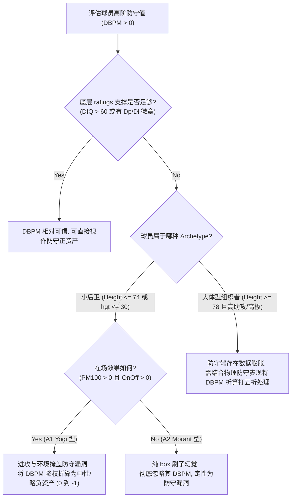

# BPM vs. 实际在场表现审计报告总结 (BPM_VS_ACTUAL_IMPACT_SUMMARY.md)

本审计项目系统分析了 BBGM 中高阶回归指标（BPM/DBPM）是否高估了以 Yogi Ferrell 为代表的小后卫的实际在场影响力，并对比了全联盟不同 Archetype 球员的在场数据，揭示了 BPM 多元回归算法在不同体型球员身上的系统性偏差。

---

## 1. 核心问题回答：BPM/DBPM 是否高估了 Yogi Ferrell 的实际表现？

必须将 **整体影响力（Overall Actual Impact）** 与 **防守端实际影响力（Defensive Actual Impact）** 进行明确区分：

### A. 整体在场影响力：没有高估

- Yogi Ferrell 在 2025 常规赛录得 BPM **+3.46**，但他在场时，费城队（PHI）每百回合净胜分高达 **+10.14** (PM100，排联盟前 6.5%)，其在场净胜效率为 **+4.79** (OnOff100)。
- 他的实际在场赢分效果强有力地支撑了其 +3.46 的总体 BPM 估计。因此，**仅凭数据表现，无法指控 BPM 高估了他的 overall 实际影响力**。他在场时，PHI 队确实极其成功地赢分。

### B. 防守端实际影响力：无法直接证实，但防守端解释极度可疑

- **数据局限性**：由于存档内不存留在场防守分拆字段（如在场时团队防守失分），PM100 和 OnOff100 都是攻防混合的净值，**在数学上我们无法直接证明 DBPM 高估了其防守端实际影响力**。
- **解释可疑性**：结合 Yogi Ferrell 极弱的防守 ratings（hgt 29, diq 54, 无 Dp），其 DBPM (+1.16) 与防守端物理事实严重冲突。根据公式拆解，防守正值主要是由于其基础 box-score 累积指标（stl/36 = 1.07, ast/36 = 6.2）和位置截距，在多元回归公式中被分配过去的。其真实的赢分价值几乎完全来自于进攻端组织（OBPM +2.29）和费城强大的球队班底。

---

## 2. 相似 DBPM 同侪对比与非小后卫高估问题

在与 Yogi 同等 DBPM（+1.16 +/- 0.50）的球员对比中，我们发现了不同 Archetype 在 BPM 回归算法下的系统性冲突：

1. **小后卫（Small Guards, 如 Ja Morant, Cole Anthony）**：
   - 存在严重的 **Box-score Proxy 冲突 (A2 组)**。例如 Ja Morant（DBPM +1.62，OnOff -4.29）和 Cole Anthony（DBPM +0.97，OnOff -1.07）。他们在场时球队其实是在输分，其 DBPM 纯粹是公式回归项强制计算出的数据幻觉，和 Yogi 的“在场赢分”不同。
2. **大体型组织者（Playmaking Bigs/Wings, 如 Jokić, Giddey, Huerter, Booker）**：
   - 存在 **大个子组织者数据虚胖问题**。例如 **Kevin Huerter** (DBPM +2.27, DIQ 52, 无徽章) 和 **Devin Booker** (DBPM +1.82, DIQ 53, 无徽章)。
   - 这类球员由于多刷了防守篮板和组织助攻，且身高较高（height >= 78），回归公式强行赋予了他们巨大的 DBPM（甚至大于 +2.0）。

### 同一种问题，还是不同问题？

- **公式底层是同一种问题（Box-score 代理幻觉）**：无论何种体型，公式都是通过助攻、抢断、篮板等累积数据倒推防守。
- **物理实体上是不同方向的问题**：
  - **Yogi 型问题（物理漏洞被漏掉）**：球员物理体型极小（ratings.hgt=29），是 GameSim 对位中的防守弱点，但公式因高抢断高助攻漏掉了这一弱点。
  - **Giddey/Jokic 型问题（数据强行吹大防守）**：大个体型在对位中不会被点名，但他们本身防守平平（DIQ极低、无徽章），只因刷了进攻助攻和篮板，就被公式虚构成“内线防守铁闸”。

---

## 3. 实用评估规则 (Practical Evaluation Rules)

在评估球员的防守价值时，对于以下特定类型的球员，**必须对 BPM/DBPM 结果进行修正或彻底降权**：

---

## 4. 审计结论可靠性分类 (Credibility Classification)

### 已验证事实 (Verified)

1. Yogi Ferrell 在场时费城队确实处于高效赢分状态（PM100 = +10.14, OnOff = +4.79），他的整体 BPM (+3.46) 并未超出赢分事实的支撑，未被整体高估。
2. 存档中不存留 stint/lineup 级别和在场防守端分拆字段，无法直接做防守端的 RAPM 或纯防守在场值提取。
3. 全联盟存在大量 `impact_gap_pm100 > +2.0` 的球员（如 Morant 等），证实了 BPM 对某些高数据但输分球员存在系统性高估。

### 方向性支持 (Directional Support)

1. Yogi Ferrell 的 +1.16 DBPM 无法体现其真实的 GameSim 个人防守，因为其 ratings（hgt 29, diq 54）在单防中会被惩罚。其高 DBPM 倾向于公式的 Proxy 幻觉。
2. 大高个组织者（如 Huerter +2.27, Booker +1.82）即使 ratings 无任何防守支撑，也会因其助攻和篮板数据被分配超高 DBPM，这支持了 BPM 回归公式在组织拼图球员防守属性划分上的系统性缺陷。

### 不能回答/仍未解决 (Unresolved)

1. 无法推导出针对不同球员的最精准 DBPM 扣减百分比。
2. 无法评估在现实 NBA 中此类球员是否会被教练点名针对。
