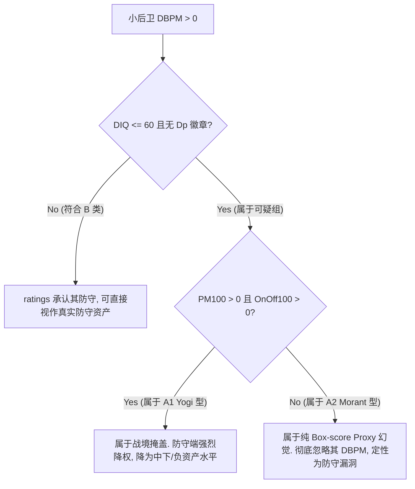

# DBPM 可信度与小后卫防守价值审计总结报告 (V2 修正版) (DBPM_CREDIBILITY_AUDIT_SUMMARY_V2.md)

本审计项目对 BBGM 2025 真实 save 中小后卫高阶指标的可信度进行了解构，重写并修正了上一版过度简化的推论。本审计的目的是从 BBGM 内部机制和数据结构出发，客观评估 DBPM 的代理有效性及其与 GameSim 的冲突。

根据最新复现的公式分解、分层统计和数据审计，本报告将核心发现与结论划分如下：

---

## 1. 已验证机制与统计事实 (Verified)

### A. Yogi Ferrell 的 DBPM 公式数学分解

我们通过全量复现 `advStats.basketball.ts` 算法，对 Yogi Ferrell 在 2025 常规赛的数据进行了解构：

- **原始防守估计强劲 (Raw DBPM = +4.1616)**：
  在引入团队调整前，Yogi 的 Raw DBPM 为 **+4.1616**。这主要受到其高助攻率（ast100 = 3.60）、高得分率、抢断（stl100 = 1.41）以及位置/角色代理截距差（interBPM - interORBPM = +0.92）的数学公式强力拟合。
- **团队调整呈下拖作用 (Team Adj DBPM = -3.0457)**：
  由于费城队（PHI）整体 Raw BPM 均值过高（全队 raw 均值大于 tmRate），分摊到 Yogi 身上的防守端团队调整量实际上是**负数（-3.0457）**。
- **验证结论**：Yogi 的正 DBPM 并非来自于“强队光环强行带正”，而是因为其个人 Raw DBPM 拟合项极度虚高（+4.16），在被团队负向调整对消后仍留存了 **+1.12**。这证实了 DBPM 是一个纯粹的 **box-score 派生指标**，无法识别其实体身高和真实单防漏洞。

### B. 小后卫 Suspicious Group 的精细分层

基于在场正负值的表现，我们将原本混合的可疑小后卫进一步拆分：

- **A1. 战境一致性可疑组 (A1_yogi_type_positive_context) [6人]**：
  Yogi Ferrell 属于此组（PM100 = +10.14, OnOff = +4.79）。这类球员在场时球队战绩良好，但这是其高进攻效率（OBPM +2.47）和强力队友（如 Giannis 等防守精英）在场的结果，防守 ratings 判定极弱。
- **A2. Box-score 投影冲突组 (A2_box_proxy_positive_dbpm_negative_context) [12人]**：
  Ja Morant（DBPM +1.62, OnOff -4.3）和 Cole Anthony（DBPM +0.97, OnOff -1.1）属于此组。这类球员在场时球队其实在输分，但因其个人抢断和组织数据出众，被公式赋予了正 DBPM。这纯粹是公式的 proxy 幻觉，不应与 A1 混为一谈。

### C. 联盟统计一致性审计

在 screened 的 64 名小后卫样本中：

- `corr(DBPM, DIQ)` 为 **0.488**，表现为低-中度相关；
- `corr(DBPM, ratings_hgt)` 仅为 **0.203**，几乎无统计相关性；
- `corr(DBPM, stl_per36)` 为 **0.451**，正相关性较强。
- **验证结论**：DBPM 波动极易受抢断率（stl）和 OVR 影响，而对真实的防守 ratings 设定（身高、DIQ）缺乏一致性响应。

---

## 2. 方向性支持与机制推论 (Directional Support)

### A. 身高与 DIQ 对 GameSim 的敏感度倾向

- 在 **hgt sensitivity 实验** 中，单纯调低 `ratings.hgt` 对胜率和净分的影响相对温和（Saben_hgt_rating_only_22 胜率仅微调 -1.0%），但叠加 DIQ 扣减和丢失 Dp 徽章后，战绩发生显著滑坡。
- **方向性推论**：在当前 GameSim 机制中，ratings 判定为优（高 DIQ、身背 Dp 徽章）的小后卫更容易体现出防守价值（如抢断和团队外线防守输出）。由于缺少一对一 matchup hunting（军训）逻辑，身高的惩罚被全队 Composite 摊薄，因此 ratings 承认的 DIQ/Dp 比单纯的物理身高更为关键。

---

## 3. 仍未回答的问题与限制 (Unresolved)

1. **现实篮球关联性**：
   BBGM 内部的数据冲突并不能证明现实里 Yogi Ferrell 或 Ja Morant 会不会在防守端被“点名单打”。
2. **精准打折参数**：
   本审计指出了小后卫 DBPM 虚高的问题，但当前数据无法推导出一个普适的“DBPM 精准折扣折算比例”。
3. **引擎修改建议**：
   是否应当通过修改 rating 生成公式、或者调整 GameSim 的对位权重来强制修正此问题，仍未达成共识。

---

## 4. Practical Evaluation Rule (实用评估准则)

当评估小后卫（物理身高 $\le 74$ 或 ratings.hgt $\le 30$）的防守战力时，**切忌直接引用 DBPM > 0 作为防守正资产的证据**。应按以下准则进行折扣和降权：

---

## 5. 下一步研究建议

1. **archetype 审计扩展**：
   除了小后卫外，BBGM 这种基于 BPM box-score 回归的公式还可能在“持球大个/空间型中锋”（如 Giddey / Jokic archetype）上产生类似的 DBPM 虚高或扭曲。建议后续建立独立的 archetype 审计项目。
2. **Yogi Ferrell 控制变量 paired-ish 1000场模拟**：
   若需更清晰的个案证据，可单独针对 Yogi Ferrell 原版与其 discount 版进行 1000 场 paired-ish 模拟，避免混入过多阵容噪声。
